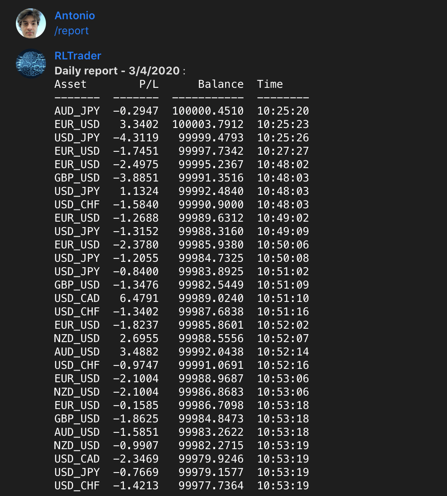
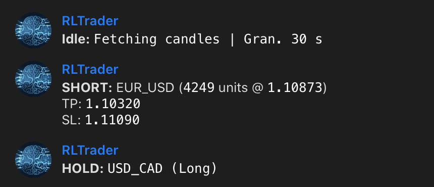
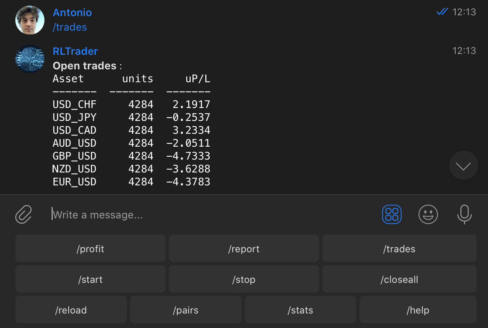
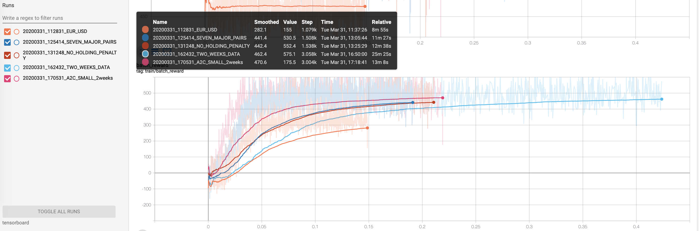

# FxTrade

FxTrade is a ForEx trading bot written in Python, with the possibility to implement strategies (both classical or based on machine learning) and trade directly on Oanda Broker (both practice or real environment). The bot can be easily integrated with Telegram for monitoring and commanding. It is designed to support all major exchanges and be controlled via Telegram. 

**If you want to know more, discuss about several machine learning approaches or contribute to this project, contact me.**

## Main components

Modules inside `fxtrade/`:

- `comm`: define the RPC messaging channel (telegram) and commands
- `data`: downloader class to download candles from exchange and utils to preprocess data and get technical indicators
- `exchange`: define the Broker class, following the same structure of the already presente Oanda Exchange class
- `optimize`: all you need for running machine learning and reinforcement learning experiment, with different datasets paradigms to feed data into networks. `agents/` folder contains deep learning strategy, such as LSTMs and Actor-Critic architectures, and are written in pytorch. `environment.py` defines classes used to process data to be fed into networks, depending on what strategy you use (ML or RL).
- `strategy`: contains strategies (Classical or ML/RL) effectively used within the fxtradebot. If you trained a network defined in `optimize/agents`, you need a wrapper within `strategy/neural.py` for that network in order to load the weights and perform inference.
- `fxtradebot.py`: contains the class `ForexTradeBot`, the main component responsible of: fetching new candles, perform actions (buy, sell, hold), store statistics to an sqlite database, communicate with telegram rpc, communicate with Broker, start new training of networks if prompted from telegram. 

## Before starting

Insert your Oanda and Telegram keys within a `config.json` file (just copy and edit info within `config.json.example`)

## Run bot

```bash
python main.py
```

Then control the operations through Telegram. Training can also be run via Telegram if properly configured.

## Run training manually

```bash
python train.py
```

Another training script is available: `train_arbitrage.py`, and this starts training following arbitrage strategy on currency triplets.

## Telegram RPC commands

Telegram is not mandatory. However, this is a great way to control your bot.

- `/start`: Starts the trader
- `/stop`: Stops the trader
- `/trades`: Show all the open trades
- `/closeall`: Closes all the open trades
- `/report [DD MM YYYY]`: Shows detailed P/L per day
- `/profit [DD MM YYYY]`: Shows statistics for each pair per day
- `/stats [DD MM YYYY]`: Shows decisions statistics for each pair per day
- `/pairs`: Show current tradeable pairs
- `/help`: This help message
- `/train` [D1 M1 D2 M2 G]' : Starts training on all the whitelist pairs, using data with granularity `G`, and rangin from `D1/M1` to `D2/M2` datetime interval.  
- `/reload`: Reload configuration file or a new neural network after training.

### daily report


### wait for new candles and act


### see open trades


## Training the Advantage Actor Critic in a Reinforcement Learning scenario (some results)

### 1st experiment: Batched Episodic Advantage GRU Actor Critic

tag: `20200331_112831`

Batch 32, total batches 216, one currency-pair EUR_USD, time per epoch: 2'

At 4th epoch learning seems to have reached an optimum (able to gain an average of 170 pips - over 16 trades - at each time step, versus a potential average gain of 230 pips).

With one currency pair, 6903 50-step time-series featured (from monday midnight to friday 9PM, one week), granularity of 1 minute, the optimal number of epochs is 2. After 2 epochs there happens loss divergences and overfitting, exploding gradients.


### 2nd experiment: One week Batched Episodic Advantage GRU Actor Critic

tag: `20200331_125414`

Batch 32, total batches 1502, all the currency-pairs listed in configs , time per epoch: 11'
Penalties for holding position. *So far the best method with highest gain.*

With all the currency pair over the past week, granularity of 1 minute, the optimal number of epochs is 1 or 2. After 2 epochs there happens loss divergences and overfitting, exploding gradients.

### 2nd experiment: 2 weeks Batched Episodic Advantage GRU Actor Critic

tag: `20200331_162432`

Batch 32, total batches 3005, all the currency-pairs listed in configs , time per epoch: 25'
Penalties for holding position. *So far the best method with highest gain.*

With all the currency pair over the past 2 weeks, granularity of 1 minute, the optimal number of epochs is 1 or 2. After 2 epochs there happens loss divergences and overfitting, exploding gradients.

### 2nd-B experiment: Batched Episodic Advantage GRU Actor Critic (No holding penalty)

tag: `20200331_125414`

Batch 32, total batches 1502, all the currency-pairs listed in configs , time per epoch: 11'
No penalties for holding position. No relevant improvements.

### 2nd-C experiment: 2 weeks Batched Episodic Advantage GRU (small) Actor Critic

tag: `20200331_170531`

Batch 32, total batches 3005, all the currency-pairs listed in configs , time per epoch: '
Penalties for holding position. Good but no real improvements.




## To Do

- [x] beautify logging telegram
- [x] connect telegram commands with Oanda api
- [x] Parallelize currency processes
- [x] Define MACD strategies and other with techical indicators
- [x] Add more validation methods for stategies
- [x] ML/TL training or statistical modeling
- [x] add training option in telegram
- [ ] automate neural nets reloading process
- [ ] Remove unused default configurations and constants
- [ ] Dockerfile and deployment on server